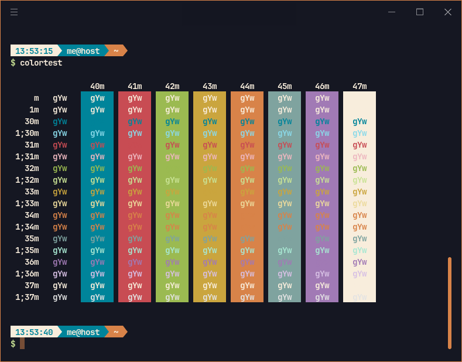

<h1 align="center">
	
    <br/>
	Emberstone for Hyper
</h1>

<div align="center">

[](#license "License")
[](https://nodejs.org "Go to Node.js homepage")


</div>

A vibrant, dark theme with warm accents to boost focus. Designed for those seeking a solid, lively environment that’s easy on the eyes.

## Preview

<div align="center">
	
</div>

## Installation

### Automatic

Executes this command to download and install theme :

```bash
 curl -s https://raw.githubusercontent.com/Emberstone-theme/hyper/main/install.sh
```

## 🎨 Color palette

You can access the always up-to-date Figma version here: [Figma Palette](https://www.figma.com/design/MVqAtxFct344uUigFxsbya/Emberstonbe-Theme-research?node-id=0-1&t=Ud7ZHjzNFhPdlMNp-1) and the [palette repo](https://github.com/Emberstone-theme/palette).

## 💬 Contributing

We welcome contributions! Whether it's reporting a bug, requesting a new feature, or directly improving the themes, your input helps shape Emberstone.

## 📢 Feedback & Support

Found a bug? Have a feature request? Head over to each project issue page to let us know.

## 📜 License

Emberstone is open-source and available under the MIT License.
